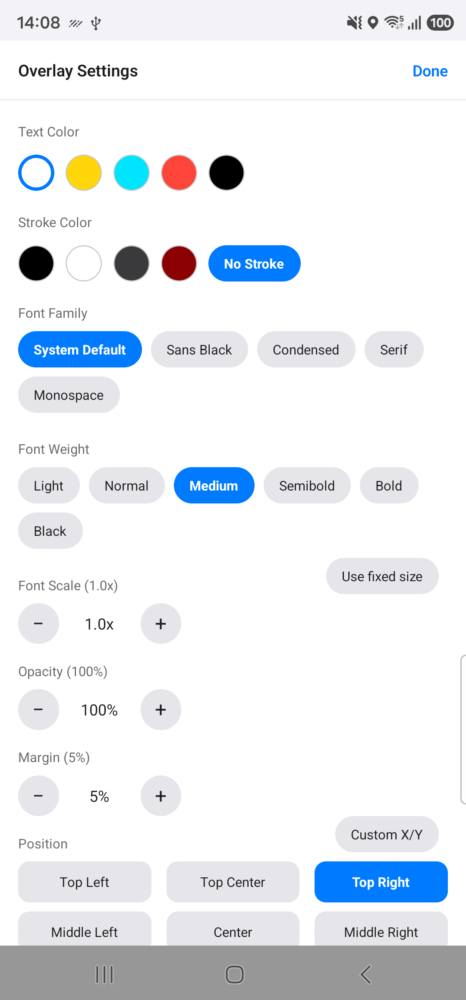
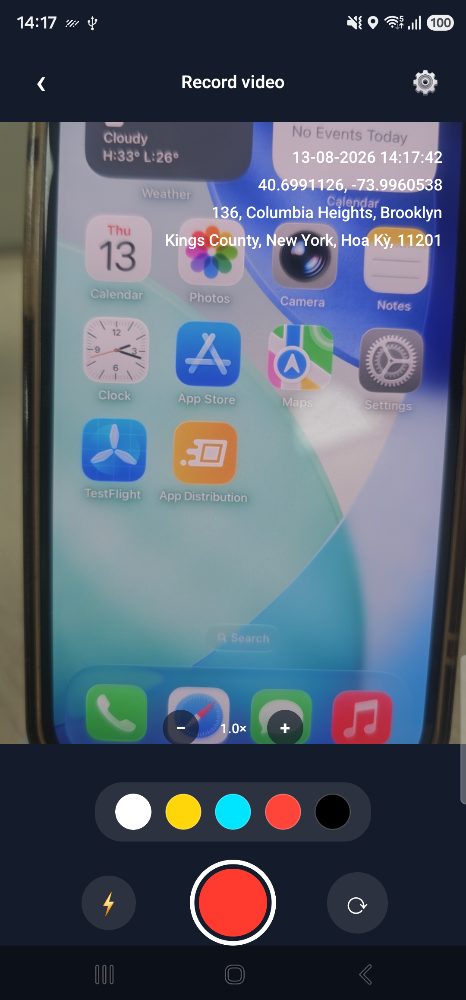

<div align="center">

# 🎬 rn-video-overlay

**Burn a text or image overlay permanently into a recorded video's pixels — native APIs only, no FFmpeg.**

[](https://www.npmjs.com/package/rn-video-overlay) [](https://opensource.org/licenses/MIT) [](https://reactnative.dev/architecture/landing-page)

</div>

## ✨ Features

- ⚡ Native-only burning — AVFoundation on iOS, MediaCodec on Android, **no FFmpeg**
- 🖼️ Time-windowed **text and image overlays**, one call can mix both across many cues
- 🎯 9 **predefined positions** or a **custom `{x, y}` coordinate** per style
- 🎨 Control **text color, stroke, font family, font scale, and margin**
- 🧩 Pass **any custom React element** as an overlay — render off-screen, capture with `react-native-view-shot`
- 🕒 Per-second cue granularity — bake in a ticking clock or a moving GPS trail
- 📼 Source video is **never modified or deleted**
- 📱 Built for the **New Architecture** (TurboModule), iOS + Android

## Example app

```sh
git clone https://github.com/lehoi2195/rn-video-overlay.git && cd rn-video-overlay && yarn
yarn example ios   # or: yarn example android
```

<p align="center">
  
  
</p>

A full showcase app:

- **Style panel** — text/stroke color, font, font scale, margin, and position (9 presets or a custom `{ x, y }`), live-updating preview before burning
- **Source video** — pick one from the library, or record live with the device camera (via [`react-native-vision-camera`](https://github.com/mrousavy/react-native-vision-camera)); both paths feed the same burn pipeline
- **Image overlay mode** — demonstrates the `imagePath` custom-layout flow (see [Custom layouts](#custom-layouts)): pick a photo from your device, it resizes live into the overlay
- **After burning** — open the result in the device's default video player, or save it to Camera Roll (via [`@react-native-camera-roll/camera-roll`](https://github.com/react-native-cameraroll/react-native-cameraroll))

The recording screen also frames a fixed 3:4 viewfinder and passes that same ratio as `cropAspectRatio` when it burns the clip — a working example of keeping a custom preview UI and the burned output in agreement (see the `cropAspectRatio` note below).

The example app deliberately does **not** use `react-native-video` for playback — see the note below.

### Why no `react-native-video` in the example app

`react-native-vision-camera`'s recording path hard-requires two things that can't both be satisfied in one app:

- `androidx.camera:camera-video` (currently pinned to an unreleased CameraX `1.7.0-alpha02`) requires `androidx.media3:media3-muxer` 1.9.0+, with no fallback to the legacy platform muxer.
- `react-native-video`'s compiled `ReactExoplayerView.java` calls a `DefaultLoadControl` constructor overload that media3 1.9.0 removed outright, so it can't compile against anything newer than 1.8.x.

Recording is the more central demo of this library's video-capture path, so the example app instead:

- previews the picked/recorded source as a static extracted frame (via [`react-native-create-thumbnail`](https://github.com/rurea/react-native-create-thumbnail)) rather than live playback
- hands the burned result off to the OS's own video player (via [`react-native-file-viewer`](https://github.com/vinzscam/react-native-file-viewer)'s `ACTION_VIEW`/`UIDocumentInteractionController`, not a share sheet — video players register to *view* files, not receive *shared* ones) instead of embedding a player

This is purely an example-app dependency conflict — `burnOverlay` itself has no media3/CameraX dependency at all (its native pipeline uses only platform `MediaExtractor`/`MediaCodec`/`MediaMuxer`/AVFoundation APIs).

## Install

```sh
yarn add rn-video-overlay
cd ios && pod install
```

Requires the **New Architecture** (TurboModule). iOS 15.1+, Android minSdk 24+.

## Usage

```ts
import { burnOverlay } from 'rn-video-overlay';

await burnOverlay({
  inputPath: '/path/to/video.mp4', // source — never modified or deleted
  outputPath: '/path/to/video_burned.mp4', // must differ from inputPath
  cues: [
    { startSec: 0, endSec: 5, lines: ['11/08/2026 14:30:00', '21.0285, 105.8048'] },
    { startSec: 5, endSec: 10, lines: ['11/08/2026 14:30:05', '21.0286, 105.8049'] },
  ],
  style: { textColor: '#FFFFFF', position: 'bottomLeft' },
});
```

Each **cue** is a `[startSec, endSec)` time window plus what to show. One cue per second bakes in a ticking clock or a moving GPS trail.

## API

### `burnOverlay(options: BurnOverlayOptions): Promise<string>`

| Field | Type | Notes |
|---|---|---|
| `inputPath` | `string` | No `file://` prefix. Never modified or deleted. |
| `outputPath` | `string` | Must differ from `inputPath`. |
| `cues` | `OverlayCue[]` | What to draw and when. |
| `style` | `OverlayStyle?` | One style for the whole call. |
| `cropAspectRatio` | `number?` | Center-crops the output to this width/height ratio (e.g. `3/4`). Trims only — never pads or upscales. |

Rejects if the source has no video track, `cues` is empty/malformed, or the encoder fails. An unreadable `imagePath` is skipped silently, not a rejection.

**Why `cropAspectRatio` exists:** a camera's preview and its recording aren't always the same shape.

- On Android, preview and recording are separate CameraX use cases — preview commonly runs the full 4:3 sensor while `VideoCapture` records a 16:9 crop of it, so a viewfinder composed at one ratio silently disagrees with the file.
- iOS shares one `AVCaptureSession` preset, so it usually matches already.
- Passing the ratio your UI composed against makes the burned output that shape on both platforms — overlay anchoring and the auto font size are computed against the cropped frame, so the result lines up with the preview.
- It only ever trims: the source is never padded or scaled up. Cropping to a ratio further from the source's own discards more picture.

### `OverlayCue`

```ts
interface OverlayCue {
  startSec: number;
  endSec: number;
  lines?: string[];    // plain text, drawn natively — cheap
  imagePath?: string;  // pre-rendered PNG, no `file://` — for custom layouts
}
```

Use **one** of `lines` / `imagePath` (image wins if both are set). Images composite at their own pixel size — no auto-scaling to the video, so capture at a resolution that already looks right.

### `OverlayStyle`

| Field | Default | Notes |
|---|---|---|
| `textColor` | `'#FFFFFF'` | Hex. `lines` only. |
| `strokeColor` | `'#000000'` | Outline color. `lines` only. |
| `strokeWidth` | auto (relative to font size) | Outline thickness in px. `0` disables the stroke entirely. `lines` only. |
| `fontFamily` | system font | Unknown names fall back silently. `lines` only. |
| `fontWeight` | `'normal'` | `'normal'` \| `'bold'` \| `'100'`...`'900'` (CSS/RN scale). `lines` only — see platform notes below. |
| `fontScale` | `1.0` | Clamped `0.5–3.0`. `lines` only. No effect when `fontSize` is also set. |
| `fontSize` | auto (video short edge × ratio) | Absolute px. `lines` only. When set, bypasses BOTH the auto-computed size AND `fontScale` entirely (no double-scaling). |
| `position` | `'bottomLeft'` | `topLeft` \| `topCenter` \| `topRight` \| `centerLeft` \| `center` \| `centerRight` \| `bottomLeft` \| `bottomCenter` \| `bottomRight`, or `{ x, y }` (each 0–1) for exact placement — `marginRatio` doesn't apply to `{ x, y }`. Applies to both `lines` and `imagePath`. |
| `marginRatio` | `0.05` | Fraction of video width, `0–0.5`. Applies to both. |
| `opacity` | `1.0` | Clamped `0–1`. Real native alpha blending. Applies to both `lines` and `imagePath`. |

**`fontWeight`** sets the weight of the system font fallback used when `fontFamily` is not set:

- **iOS:** no effect once a custom `fontFamily` resolves — its PostScript name already bakes in a weight.
- **Android:** also applies to a custom `fontFamily`, since `Typeface.create` still honors it. On API 24-27 (minSdk) it degrades to the old binary NORMAL/BOLD styles (600+ → bold).

**`fontSize` is in the *output video's own pixel space*, not a typical UI/CSS size.**

- Default (unset): the `fontScale`-driven auto formula is `min(videoWidth, videoHeight) × ~0.03` — self-scales correctly no matter the video's resolution, which is why it's the default and why `fontScale` "just works" across devices.
- `fontSize`, by contrast, is an *absolute* pixel count in that same coordinate space: `fontSize: 40` means exactly 40px tall text burned into the video, full stop — under 4% of frame height on a 1080p (1920×1080) video, proportionally tinier on 4K.
- It's an intentional escape hatch for callers who know their video's exact resolution and want pixel-precise control (e.g. matching a design mockup) — reach for `fontScale` unless you specifically need that.
- Building your own preview UI (as the example app does)? Scale `fontSize` by `previewFrameWidth / realVideoWidth` before handing it to a `<Text>` component, or it'll look wildly larger on screen than in the actual burned output.

## Custom layouts

`lines` only draws stacked plain text. For icons, colors, or richer layout, render **any custom React element** — your own component, arbitrary JSX, whatever you'd normally put on screen — off-screen inside a [`react-native-view-shot`](https://github.com/gre/react-native-view-shot) `<ViewShot>`, capture it to a PNG, and pass that as `imagePath`. The library never sees JSX, only the rasterized bitmap — so `imagePath` can carry anything a `View` can render (icons, gradients, third-party components), not just what `lines` supports.

```tsx
const viewShotRef = useRef<ViewShotRef>(null);
const viewShotOptions = { format: 'png' as const };

// Mount persistently (not just right before a burn) — ViewShot defers capture
// until the first onLayout, and mounting on demand would race that. Position
// off-screen rather than opacity: 0, since native snapshotting can render
// hidden content as blank.
<View style={styles.offscreenCapture} pointerEvents="none">
  <ViewShot ref={viewShotRef} options={viewShotOptions}>
    <MyCustomOverlay title="11/08/2026 14:30:00" coords="21.0285, 105.8048" />
  </ViewShot>
</View>
```

```ts
async function buildImageCue(viewShotRef: RefObject<ViewShotRef | null>): Promise<OverlayCue> {
  if (!viewShotRef.current) {
    throw new Error('The custom overlay card is not ready to capture yet.');
  }
  const uri = await viewShotRef.current.capture();
  const imagePath = uri.startsWith('file://') ? uri.slice(7) : uri;
  return { startSec, endSec, imagePath };
}
```

Each cue is one capture (~50–200ms) — budget accordingly for many cues. Use `imagePath` only when `lines` isn't enough. See [`example/src/components/PickedImageOverlay.tsx`](example/src/components/PickedImageOverlay.tsx) and [`example/src/utils/cueBuilders.ts`](example/src/utils/cueBuilders.ts) for a complete working version — the example app's "Image overlay" mode lets you pick any photo from your device, resizes it to a configurable box via this exact pattern, and burns the result in.

## Known limitations

- Android portrait rotation (`KEY_ROTATION`) not exhaustively tested across devices.
- iOS forces BT.709 SDR output (avoids HDR desaturation on iPhone 12+), not yet compared on-device.
- No automated test suite — verified via source review + syntax-checking so far.
- The example app's iOS camera-permission `Podfile` `post_install` hook (`NSCameraUsageDescription`/`NSMicrophoneUsageDescription` for `react-native-vision-camera`) has been confirmed to inject both keys into the generated Xcode project via `pod install`, but the actual on-device permission prompt (with the custom message) has not been verified by running the app on a simulator/device.

## License

MIT
